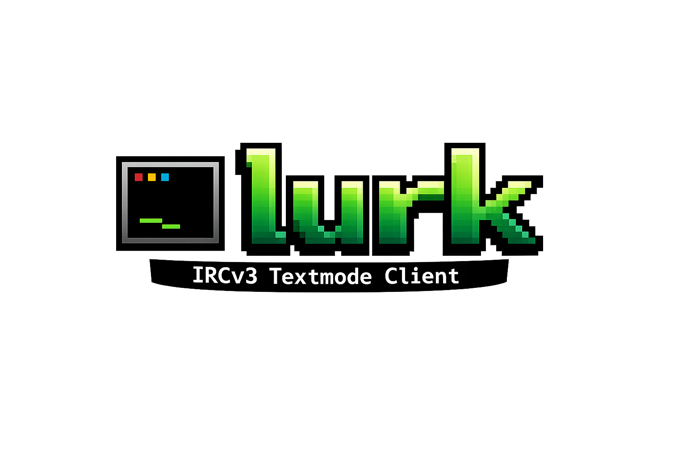

<p align="center">
  
</p>

## Status

- **Protocol library** (`irc`, `conn`, `cap`, `sasl`, `isupport`, `client`) —
  message parsing & serialization with full message-tag support, TCP/TLS
  transport, capability negotiation, SASL (PLAIN/EXTERNAL), `RPL_ISUPPORT` +
  casemapping, and a high-level client with registration, event dispatch, and
  channel/user state tracking. Standard library only.
- **Terminal UI** (`tui`, `cmd/lurk`) — a [Bubble Tea](https://github.com/charmbracelet/bubbletea)
  full-screen client: buffer sidebar, scrollback, nicklist, status bar, input
  editor with history and tab-completion, slash commands, and an interactive
  nicklist with a per-user context menu (message, whois, and a Status sub-menu
  that grants/revokes any membership mode the server offers — op, half-op, voice,
  founder/admin — plus kick and ban).
- **IRCv3 features** — capability negotiation plus live handling of
  `away-notify`, `account-notify`/`extended-join`, and `chghost` (away users are
  dimmed and logged-in users badged in the nicklist); `batch`; `draft/chathistory`
  (recent backlog is fetched automatically on join and shown under a history
  divider); `+typing` notifications ("X is typing…" in the status bar, debounced
  outbound); and `standard-replies` (`FAIL`/`WARN`/`NOTE`) rendered readably.

## Install

```sh
go install github.com/exec/lurk/cmd/lurk@latest   # or: go build ./cmd/lurk
```

## Run

```sh
# Network launcher: pick (or add/edit/delete) a saved network, then connect
lurk

# Connect directly to a saved network by name (skips the launcher)
lurk libera

# Plaintext
lurk -server irc.example.net:6667 -nick yournick -channel '#chan'

# TLS + SASL
lurk -server irc.example.net:6697 -tls -nick yournick \
     -sasl PLAIN -sasl-user account -sasl-pass secret -channel '#chan'

# Line-mode (no full-screen UI), useful for scripting
lurk -plain -server irc.example.net:6667 -nick yournick -channel '#chan'
```

Run with no `-server` to open the **network launcher** — a list of saved
networks (each bundling its own identity and optional SASL), with connect / add /
edit / delete. Networks persist to `~/.config/lurk/config.json` (XDG-aware;
override with `-config` or `LURK_CONFIG`), written `0600` since passwords are
stored in cleartext. Passing `-server` connects directly and skips the launcher.

All flags have `LURK_*` environment-variable equivalents. Sending credentials
(`-pass` or SASL) over a non-TLS connection is refused by default; pass
`-insecure-auth` (or `LURK_INSECURE_AUTH=1`) to allow it knowingly.

### Keys (TUI)

| Key | Action |
|-----|--------|
| type + `Enter` | send to the active buffer |
| `Tab` | complete nick / channel / command |
| `↑` / `↓` | input history |
| `Ctrl-N` / `Ctrl-P` | next / previous buffer |
| `Ctrl-U` | focus the Users list; `↑/↓` select, `Enter` opens the menu, `Esc` back |
| `PgUp` / `PgDn` — **`Fn-↑` / `Fn-↓` on a Mac** | scroll a page (works in every terminal) |
| `Shift-↑` / `Shift-↓` | scroll a few lines (also `Alt-↑/↓`, or `Ctrl-↑/↓` off macOS) |
| `Ctrl-C` | quit |

**Scrolling on macOS:** use `Fn-↑` / `Fn-↓` (these are `PgUp`/`PgDn`) — they reach
the app in every terminal, including Apple's Terminal.app. `Shift-↑/↓` line
scrolling needs a terminal with Kitty-keyboard support (iTerm2, Ghostty, Kitty,
WezTerm, Alacritty); Terminal.app can't send `Shift-↑/↓`, and macOS reserves
`Ctrl-↑/↓` for Mission Control.

Slash commands: `/join /part /msg /query /nick /me /away /whois /whowas /list
/topic /names /mode /op /deop /voice /devoice /kick /ban /unban /invite /notice
/ctcp /motd /ignore /unignore /highlight /unhighlight /search /clear /close /raw
/connect /disconnect /help /quit` — type `/help` in-app for the keys and command
list, or `/help <command>` for usage. Alt+1…9 jump to a buffer by position;
Alt+A jumps to the next active buffer; `/search <text>` finds scrollback (Ctrl-R
cycles matches).

Lurk connects to **multiple networks at once**: `/connect <name>` dials another
saved network and folds it into a unified sidebar grouped by network;
`/disconnect` drops the current one.

Lurk auto-reconnects (with backoff) after an unexpected disconnect and re-joins
your channels; a mention in a buffer you're not watching rings the terminal bell;
and it answers standard CTCP queries (VERSION/PING/TIME/CLIENTINFO).

The theme follows your terminal: a dark (Catppuccin Mocha) or light (Latte)
palette is chosen from the detected background, and `NO_COLOR` switches to a
monochrome theme.

Pass `-log` (or `LURK_LOG=1`) to write per-channel plain-text chat logs under
`~/.local/share/lurk/logs/` (XDG-aware; override with `LURK_LOG_DIR`).

## Packages

```
irc/       wire protocol: Message, parse/serialize, tags, numerics, commands
conn/      TCP/TLS transport, framed read/write, send queue
cap/       capability negotiation state machine
sasl/      SASL mechanisms (PLAIN, EXTERNAL)
isupport/  RPL_ISUPPORT token parsing + casemapping
client/    high-level client: registration, events, state tracking
tui/       Bubble Tea terminal UI
cmd/lurk/  the client binary (TUI by default, -plain for line mode)
```

## Development

```sh
go build ./...
go test -race ./...
```

An optional live test runs against a real server when `LURK_TEST_SERVER` is set;
otherwise it skips and the suite is fully hermetic.

See [`docs/ARCHITECTURE.md`](docs/ARCHITECTURE.md) and
[`docs/ARCHITECTURE-TUI.md`](docs/ARCHITECTURE-TUI.md) for the design,
[`docs/PACKAGING.md`](docs/PACKAGING.md) for building and releases, and
[`CHANGELOG.md`](CHANGELOG.md) for the release history.

## Credits

Built with the help of, and tested against, [Ergo](https://github.com/ergochat/ergo);
the TUI uses [Bubble Tea](https://github.com/charmbracelet/bubbletea),
[Bubbles](https://github.com/charmbracelet/bubbles), and
[Lip Gloss](https://github.com/charmbracelet/lipgloss), with
[senpai](https://git.sr.ht/~delthas/senpai) as a UX reference. See
[`CREDITS.md`](CREDITS.md).

## License

MIT
